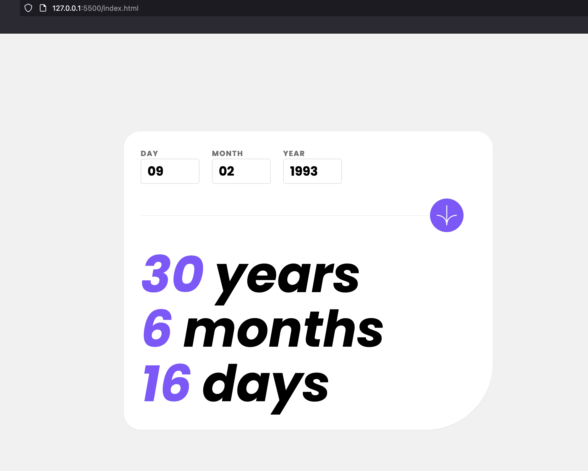

# Frontend Mentor - Age calculator app solution

This is a solution to the [Age calculator app challenge on Frontend Mentor](https://www.frontendmentor.io/challenges/age-calculator-app-dF9DFFpj-Q). Frontend Mentor challenges help you improve your coding skills by building realistic projects. 

## Table of contents

- [Overview](#overview)
  - [The challenge](#the-challenge)
  - [Screenshot](#screenshot)
  - [Links](#links)
- [My process](#my-process)
  - [Built with](#built-with)
  - [What I learned](#what-i-learned)
- [Author](#author)

## Overview

### The challenge

Users should be able to:

- View an age in years, months, and days after submitting a valid date through the form
- Receive validation errors if:
  - Any field is empty when the form is submitted
  - The day number is not between 1-31
  - The month number is not between 1-12
  - The year is in the future
  - The date is invalid e.g. 31/04/1991 (there are 30 days in April)
- View the optimal layout for the interface depending on their device's screen size
- See hover and focus states for all interactive elements on the page

### Screenshot

### Links

- Solution URL: [Add solution URL here](https://your-solution-url.com)
- Live Site URL: [Add live site URL here](https://your-live-site-url.com)

## My process

### Built with

- Semantic HTML5 markup
- [TailwindCSS](https://tailwindcss.com/) - CSS Framework
- Plain old Javascript

### What I learned

I learned how to use TailwindCSS and how to use it with a bundler like Webpack. I also learned how to use the date object in Javascript and it's finicky nature.

I've also learned that, whilst short and efficient code has its place, it shouldn't be at the expense of readability. I've tried to keep my code as readable as possible, but I'm sure there are still improvements to be made.

Working with responsive design is still a challenge for me, but I'm getting better at it. I'm still not sure if I'm doing it the right way, but I'm getting there.

To see how you can add code snippets, see below:

## Author

- Frontend Mentor - [@danmeldominique](https://www.frontendmentor.io/profile/danmeldominique)
- Github - [danmeldominique](https://github.com/danmeldominique)